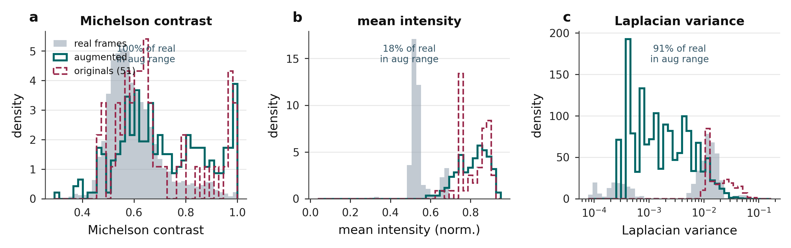

# How the working data was built.

**Thesis target:** Theme 00 / Data construction & provenance / Appendix A.0.

> None of the analysis CSVs were handed over. They were constructed from 99,055 raw brightfield frames and five delivered metadata workbooks: matched to patients, segmented, measured, and split. This theme shows that construction with code.

Before any result, the raw delivery had to become a working corpus. This theme traces it end to end: (A) the raw data as delivered, counted from disk; (B) the match that links image filenames to patient and condition metadata; (C) the derived working tables, each shown as input to construction step to output; and (D) the constructed corpus every later theme consumes. Every count is read live from disk.

| Metric | Value | Note |
|---|---|---|
| Raw images | 99,055 | 75,043 tif + 23,913 jpg + 99 png; 312 GB, two lab archives. |
| Delivered metadata | 3+2 | 3 Pooled AI workbooks + legend + template (VID, Well, Volgnummer). |
| Hand annotations | 51 | VIA polygons rasterised to masks; ~0.05% of the corpus. |
| Derived corpus | 12,485 | Frames matched, QC'd and feature-extracted, all constructed. |

## A. The raw data, as delivered  (counted from disk, not assumed)

The lab delivered two archives (Vivek Muniraj, 2025) totalling **312 GB** under `data/raw/`. Nothing here is derived: these are the original IncuCyte brightfield time-lapses and the metadata workbooks. Every count below comes from `find` and `wc -l` run against the disk.

### Raw archive layout and image census

2 delivered archives -> extracted IncuCyte trees -> 99,055 frames

*$ du -sh data/raw  |  $ find data/raw -iname '*.tif' | wc -l*

```python
data/raw/                                              # 312 GB, delivered
|- O20250116 ... 1st final data transfer.tar.gz   88 GB -> Drug screens/ (14 exp) + NK/
'- 20250123 ... 2nd final data transfer.7z        71 GB -> Btk/ Refractory/ Ongoing/ T/
        leaf image folders are named 'IncuCyte export'

$ find data/raw -iname '*.tif' | wc -l        # 75,043
$ find data/raw -iname '*.jpg' | wc -l        # 23,913
$ find data/raw -iname '*.png' | wc -l        #     99
                                              # = 99,055 brightfield frames

filename encodes everything:  VID1797_E4_1_00d03h00m.tif
                              |VID-| |well| |  |-timepoint-|
                                          field  (00d03h00m = 3 h elapsed)
```

The filename is the primary key for every downstream join: VID (video/experiment), Well (plate position, one spheroid), field and elapsed timepoint.

### Delivered metadata workbooks

5 delivered .xlsx -> one sheet per experiment -> VID + Well + Volgnummer

*data/metadata/*.xlsx  (+ metadata_legend.xlsx data dictionary)*

```python
Btk inhibitors - Pooled AI metadata.xlsx      (8 experiment sheets)
Drug screen 1 - Pooled AI metadata.xlsx       (13 experiment sheets)
Refractory patients - Pooled AI metadata.xlsx (3 experiment sheets)
Template_IncuCyte_metadata_list_for_AI_MH.xlsx  (blank schema)
metadata_legend.xlsx                            (data dictionary)

columns:  Experiment | VID | Well | Volgnummer | Sex | Birth year | IGHV |
          Rai Stage | Stimulation | Treatment | Target | Concentration (nM) | ...

legend:   VID        = Video ID (one IncuCyte experiment)
          Well       = position in the plate, unique per spheroid
          Volgnummer = number of the patient's blood draw  <-- patient identity
```

Volgnummer is the canonical patient id; VID is the experiment id. They are kept apart on purpose (one patient can span several VIDs, see the match below).

## B. The match: images to patients and conditions  (filename decode, then a keyed join)

The images arrive as bare filenames; the biology lives in the workbooks. Matching the two is the join at the heart of the dataset. It is a two-stage design: decode the filename into structured fields, then join those fields to the metadata on `(VID, Well)`.

### Stage 1: decode the filename

image stem -> regex -> VID / Well / field / timepoint

*shared/io.py:66, 97*

```python
_VID_PATTERN = re.compile(r"^(VID\d+)_([A-Z]\d+)_(\d+)_(\d+d\d+h\d+m)(.*)$")

def parse_vid_stem(stem):                 # 'VID1797_E4_1_00d03h00m'
    m = _VID_PATTERN.match(stem)
    return {"vid":   m.group(1),          # VID1797
            "well":  m.group(2),          # E4
            "field": m.group(3),          # 1
            "timepoint": m.group(4)}      # 00d03h00m  -> 180 min
```

Older frames use a BF_ / Brightfield_ convention without a VID; those fall back to an (experiment, Well) key instead.

### Stage 2: join filename fields to patient + condition

frame_qc.csv -> merge on (VID, Well) -> patient + treatment per frame

*imaging_eda/patient_map.py:58, 68, 105*

```python
# Volgnummer IS the patient; build a (VID, Well) -> patient lookup
M["patient"] = M["Volgnummer"].map(_norm_vid)
vw = M.set_index(["VID", "Well"])["patient"].to_dict()

# attach patient, drug, target, stimulation to every segmented frame
qc = pd.read_csv("frame_qc.csv")
j  = qc.merge(meta, on=["VID", "Well"], how="left")     # <-- the join
j.to_csv("frame_patient_treatment.csv")
```

Excel contamination is handled here: VIDs arrive as 1797.0 and wells as A01, normalised to VID1797 / A1 before the join.

### The patient roster: 5 patients, 7 series

6 VID experiments -> hardcoded roster -> 5 unique patients

*rq3_inference/results_chapter/run_cross_patient_inference.py:46*

```python
PATIENTS = [                       # (VID, patient_id)
    (1087, "2089"),               #  patient 2089
    (1873, "706_t1"),             #  patient 706, timepoint 1
    (2017, "706_t2"),             #          706, timepoint 2   <- one patient,
    (2319, "706_t3"),             #          706, timepoint 3      three VIDs
    (1964, "EE5.1_refractory"),   #  refractory patient
    (2359, "708"),               #  patient 708
]   #  VID1797 -> patient 267 (control only)
    #  5 unique patients  ->  7 patient-timepoint series
```

This is why the cohort is 5 patients but 7 series: patient 706 was sampled longitudinally across three separate IncuCyte runs. VID is never the patient.

## C. The derived working tables  (input to construction step to output)

With frames matched to biology, the working tables are computed. Each one below is shown as its provenance triple: the raw **input**, the **construction step** in code, and the **output** file it writes, so it is clear the tables were generated, not received.

### Shape features from masks (regionprops)

binary mask -> skimage regionprops -> per_image_features.csv (405 rows)

*rq3_inference/extract_features.py:128*

```python
from skimage.measure import regionprops

def compute_spheroid_features(mask):
    p = regionprops(mask)[0]                      # the one spheroid region
    area, perim = int(p.area), float(p.perimeter)
    return {"total_area": area,
            "equivalent_diameter": _equivalent_diameter(p),
            "eccentricity": float(p.eccentricity),
            "solidity":     float(p.solidity),
            "perimeter":    perim,
            "circularity":  4*math.pi*area / perim**2}
```

These six numbers are the observables every later theme consumes. Output header: image_id, model, total_area, equivalent_diameter, eccentricity, solidity, perimeter, circularity.

### Frame quality table (contrast, focus, fragmentation)

mask + raw TIFF -> per-frame metrics -> frame_qc.csv (12,485 rows)

*imaging_eda/build_tables.py:174, 195*

```python
# intensity / contrast / focus, per frame
p5, p95 = np.percentile(gray, [5, 95])
michelson_contrast = (p95 - p5) / (p95 + p5)
lap_var            = filters.laplace(gray).var()      # focus

# fragmentation, from the connected components of the mask
areas = [r.area for r in regionprops(measure.label(mask))]
frag_index = 1.0 - max(areas) / sum(areas)            # 0 = one blob

res.to_csv('imaging_eda/cache/frame_qc.csv')          # 12,485 frames
```

frame_qc.csv is the spine of Theme 01 and the coverage analysis: 12,485 rows, 40 columns of QC + join keys.

### Train / val / test split (source-stratified, seed 42)

51 spheroids x 6 frames -> stratified shuffle -> train/val/test .txt

*rq1_segmentation/scripts/dataset/build_training_dataset.py:344*

```python
rng = np.random.RandomState(42)
for source in df["source"].unique():        # stratify by source plate
    idx = df[df.source == source].index.values
    rng.shuffle(idx)
    #  ~70 / 15 / 15  ->  train / val / test
for split in ["train", "val", "test"]:
    (out / f"{split}.txt").write_text("\n".join(ids[split]))

#  wc -l splits/*.txt  ->  train 216,  val 45,  test 45
#  original spheroids  ->  37 / 7 / 7   (six frames each)
```

The genuinely plate-stratified 5-fold CV split (patient/plate held out) is a separate generator, train_pseudolabel.make_folds, used for the pseudo-label model.

## D. The constructed working corpus  (every row traceable to a raw input)

### From raw delivery to working tables, each traceable to its source

| Asset | Count (from disk) | What it is | Origin |
|---|---|---|---|
| Raw brightfield archive | 99,055 images | 75,043 .tif + 23,913 .jpg + 99 .png, 312 GB | data/raw/ (delivered) |
| Delivered lab metadata | 3 workbooks + legend + template | Pooled AI metadata, keyed VID + Well, Volgnummer = patient | data/metadata/*.xlsx (delivered) |
| Hand annotations (VIA) | 6 experiments | via_region_data JSON polygons + annotated jpgs | 3D annotations/ (delivered) |
| Ground-truth masks | 51 masks | VIA polygons rasterised to instance masks | derived from annotations |
| Frame-QC table | 12,485 frames | contrast, focus, fragmentation per segmented frame | built by build_tables.py |
| Patient / condition join | 12,485 rows | frames joined to 5 patients / 7 series, drug + stimulation | built by patient_map.py |
| Regionprops feature table | 6 features / frame | area, diameter, eccentricity, solidity, perimeter, circularity | built by extract_features.py |
| Train / val / test split | 216 / 45 / 45 images | 37 / 7 / 7 original spheroids, source-stratified, seed 42 | built by build_training_dataset.py |
| Classical pseudo-labels | 4,547 masks | classical-pipeline masks for stage-1 pretraining | built by the classical pipeline |

### Corpus scale and label scarcity - hover for counts

*(interactive chart in the HTML version)*

**What it shows.** Only 51 of 99,055 frames are hand-annotated (about 0.05%), expanded to 306 by augmentation. The held-out test set is 45 frames.

**What it motivated (Decision: two-stage training).** A 1-in-2000 label ratio motivates the two-stage training strategy: pretrain on 4,547 classical pseudo-labels, then fine-tune on the 51 ground-truth masks.

## Explore the corpus you just built  (the six derived features, interactively)

## Augmentation: a shared set, plus a heavier U-Net policy  (two different things, often confused)

### Does the offline augmented set cover the real regimes? - real vs augmented vs 51 originals



**What it shows.** The offline augmented training set (the 51 originals expanded to 306 pairs, shared by every model) spans 100% of the real contrast range and 91% of the focus (Laplacian-variance) range, but only 18% of the mean-intensity range; brightness is the axis it covers least.

**What it motivated (Offline set, shared by all models).** This figure is about the offline augmented dataset that all candidates train on. It is a separate thing from the 'heavy augmentation' U-Net variant, which is a training time policy, shown in code below.

### What 'heavy augmentation' actually means

shared offline set -> U-Net online policy -> standard vs heavy

*run_experiments.py:70, 84*

```python
# EVERY model trains on the same offline-augmented set (51 -> 306 pairs).
# 'Heavy augmentation' is one U-Net variant's stronger ON-THE-FLY policy,
# applied per batch during training, NOT a different dataset.

def aug_standard(res):                    def aug_heavy(res):
    Resize, HFlip, VFlip, Rotate90            Resize, HFlip, VFlip, Rotate90
    ShiftScaleRotate(0.05, 0.1, 15)          ShiftScaleRotate(0.10, 0.2, 30)   # stronger
    ElasticTransform(alpha=30)               ElasticTransform(alpha=50)        # stronger
    RandomBrightnessContrast(0.15)           RandomBrightnessContrast(0.30)    # stronger
    GaussNoise(p=0.2)                        GaussNoise(10-50, p=0.4)          # stronger
                                             GridDistortion(0.3)              # + extra
                                             GaussianBlur(3-7)                # + extra
                                             CoarseDropout(8 x 32px)          # + extra
```

So 'U-Net (heavy aug.)' is the resnet34 U-Net trained with aug_heavy: three transforms the standard policy does not use (grid distortion, blur, coarse dropout) plus roughly double the strength on the rest. That heavier regularisation, not a different training set, is what the name refers to.

## Complete analysis index  (every thesis analysis in this theme)

### Each analysis, what it shows, its thesis label, and the result

| Analysis | What it shows | Thesis label | Key result / status |
|---|---|---|---|
| Cohort & dataset inventory | Patients, frames, channels, label counts, splits, drug panel, real wells | appendix:data:eda | Shown as the inventory table above |
| Data augmentation | 11 geometric + photometric ops, 51 originals to 255 augmented pairs | app:aug / tab:aug_ops | 5 augmentations per original |
| Patient mapping & split | Train/val/test 216/45/45 images (37/9/8 spheroids), plate-level stratification | app:patient_mapping / tab:patient_mapping | P1043 noted in train and test |

**Sources / tools:** shared/io.py, imaging_eda/patient_map.py, imaging_eda/build_tables.py, rq3_inference/extract_features.py, build_training_dataset.py, unet/run_experiments.py, Complete_EDA.ipynb
