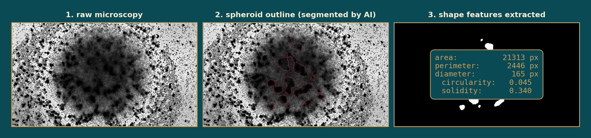
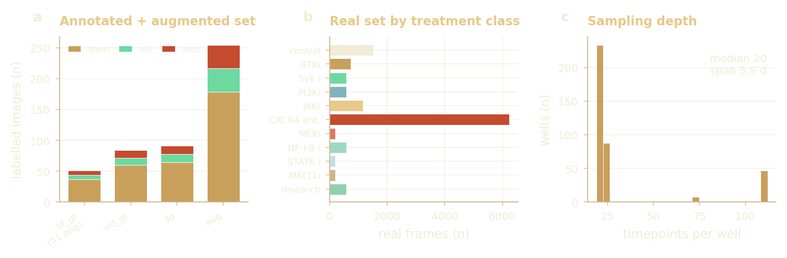

# What the dataset is.

**Thesis target:** Theme 00 / Data inventory / Appendix A.0.

> Before any analysis: exactly what data exists. Five CLL patients (seven patient-timepoint series), a roughly 99,000-frame brightfield archive, and only 51 hand-drawn masks, the single constraint that shapes every downstream method choice.

This theme is the ledger for the whole project: the cohort, the imaging, the frame counts, the label budget, the train/val/test split and the drug panel, all in one place. Theme 01 then characterises what those images **look like**; Themes 02 to 05 build the segmentation, simulation and inference on top of this inventory.

| Metric | Value | Note |
|---|---|---|
| Patients | 5 | Unique CLL donors; 7 patient-timepoint series (706 sampled x3). |
| Raw frames | 99k | Brightfield archive; 12,485 in the real inference set. |
| Hand-annotated | 51 | About 0.05% of the corpus, the defining constraint. |
| Drug panel | 23 | Drugs across seven mechanism classes. |

### What the pipeline does, end to end - raw frame to outline to shape numbers

**What it shows.** A microscopy frame goes in, the AI draws the spheroid outline, and a handful of shape numbers come out. Those numbers are the observables every later stage consumes.

**What it motivated (Frames the whole pipeline).** Fixes the unit of analysis: the segmenter is judged on whether these shape numbers are trustworthy, not on raw pixel overlap.

## The cohort and corpus, at a glance  (every asset, counted)

### Data inventory: cohort, imaging, frames, labels, splits and the drug panel

| Asset | Count | Detail | Where it is used |
|---|---|---|---|
| Patients (CLL donors) | 5 unique | 7 patient-timepoint series (706 sampled at t1/t2/t3); 4 patients in the drug panel | RQ3 real-data inference |
| Imaging channel | 1 | Brightfield, single-channel grayscale time-lapse | All stages |
| Raw archive | ~99,000 frames | Full local brightfield archive | Corpus |
| Real inference set | 12,485 frames | Segmented for feature extraction | Themes 01 & 05 |
| Hand-annotated masks | 51 frames | About 0.05% of the corpus, the defining constraint | RQ1 ground truth |
| Classical pseudo-labels | 4,552 frames | Classical-pipeline masks for stage-1 pretraining | RQ1 stage 1 |
| Train / val / test split | 216 / 45 / 45 images | 37 / 9 / 8 spheroids, plate-level stratified | RQ1 |
| Held-out test | 45 frames | Never seen during training | RQ1 evaluation |
| Drug panel | 23 drugs | BTKi, Syk, PI3K, JAK, CXCR4, MEK, NF-kB classes | RQ3 drug response |
| Real wells (coverage) | 152 wells | Control, stimulated and drug conditions | Morphospace coverage |
| Sampling depth | ~20 timepoints / well | Median, over roughly 5.5 days | Time-course features |

## Corpus scale and the label bottleneck  (cohort & the defining constraint)

### Corpus scale and label scarcity - hover for counts

*(interactive chart in the HTML version)*

**What it shows.** Only 51 of roughly 99,000 frames are hand-annotated (about 0.05%), expanded to 306 by augmentation. The held-out test set is 45 frames.

**What it motivated (Decision: two-stage training).** A 1-in-1000 label ratio motivates the two-stage training strategy: pretrain on classical pseudo-labels, then fine-tune on the 51 ground-truth masks.

### Dataset composition - annotated split &middot; real set by class &middot; sampling depth

**What it shows.** The 51 ground-truth frames expand to about 255 augmented pairs across the train/val/test split; the ~12k-frame inference corpus is dominated by CXCR4-antagonist and control wells, each sampled at a median of 20 timepoints over roughly 5.5 days.

**What it motivated (Cohort & the defining constraint).** The label scarcity and the class imbalance together drive the plate-stratified split and the two-stage training that pretrains on pseudo-labels before fine-tuning on the 51 masks.

## Does augmentation cover the real regimes?  (real vs augmented vs the 51 originals)

### Does augmentation cover the real regimes? - real vs augmented vs 51 originals

**What it shows.** Augmentation spans 100% of the real contrast range and 91% of the focus (Laplacian-variance) range, but only 18% of the mean-intensity range; brightness is the axis it covers least.

**What it motivated (Validates heavy augmentation).** Confirms the heavy-augmentation U-Net is trained across the contrast and focus regimes it will meet at inference; the intensity gap is the one residual exposure.

## Complete analysis index  (every thesis analysis in this theme)

### Each analysis, what it shows, its thesis label, and the result

| Analysis | What it shows | Thesis label | Key result / status |
|---|---|---|---|
| Cohort & dataset inventory | Patients, frames, channels, label counts, splits, drug panel, real wells | appendix:data:eda | Shown as the inventory table above |
| Data augmentation | 11 geometric + photometric ops, 51 originals to 255 augmented pairs | app:aug / tab:aug_ops | 5 augmentations per original |
| Patient mapping & split | Train/val/test 216/45/45 images (37/9/8 spheroids), plate-level stratification | app:patient_mapping / tab:patient_mapping | P1043 noted in train and test |

**Sources / tools:** RQ1_segmentation/01_data_eda.ipynb, patient_mapping, augmentation ops, drug panel metadata, 5 patients / 7 series
