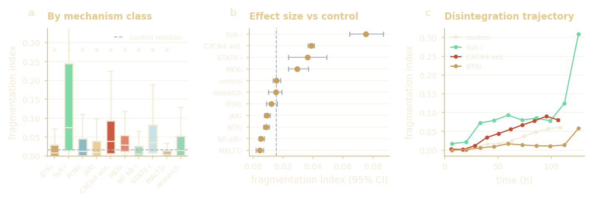

# What the data demands.

**Thesis target:** Theme 01 / Data exploratory analysis / Appendix A.1.

> The imaging reads size and gross shape robustly, but contrast, focus and fragmentation limit the finer boundary features, the same loss that later caps CPM-parameter identifiability.

Brightfield microscopy of patient-derived CLL spheroids is low-contrast, unevenly lit, and frequently fragmented under drug treatment. This analysis characterises what the images **are** (intensity, contrast, focus, illumination and fragmentation) and what the dataset **contains**, then traces each property to the segmentation, metric and feature choice it drove downstream.

| Metric | Value | Note |
|---|---|---|
| Raw frames | 99k | Local archive; 12,485 in the real inference set. |
| Hand-annotated | 51 | About 0.05% of the corpus, the defining constraint. |
| Contrast covered by aug. | ~100% | Focus ~91%; validates the heavy-aug U-Net. |
| Real wells out-of-library | ~90% | Why the thesis reports relative shifts, not absolutes. |

## A. What is the dataset?  (cohort & the defining constraint)

### Corpus scale and label scarcity - hover for counts

*(interactive chart in the HTML version)*

**What it shows.** Only 51 of roughly 99,000 frames are hand-annotated (about 0.05%), expanded to 306 by augmentation. The held-out test set is 45 frames.

**What it motivated (Decision: two-stage training).** A 1-in-1000 label ratio motivates the two-stage training strategy: pretrain on classical pseudo-labels, then fine-tune on the 51 ground-truth masks.

### What the pipeline does, end to end - raw frame to outline to shape numbers

**What it shows.** A microscopy frame goes in, the AI draws the spheroid outline, and a handful of shape numbers come out. Those numbers are the observables every later stage consumes.

**What it motivated (Frames the whole pipeline).** Fixes the unit of analysis: the segmenter is judged on whether these shape numbers are trustworthy, not on raw pixel overlap.

### Dataset composition - annotated split &middot; real set by class &middot; sampling depth

**What it shows.** The 51 ground-truth frames expand to about 255 augmented pairs across the train/val/test split; the ~12k-frame inference corpus is dominated by CXCR4-antagonist and control wells, each sampled at a median of 20 timepoints over roughly 5.5 days.

**What it motivated (Cohort & the defining constraint).** The label scarcity and the class imbalance together drive the plate-stratified split and the two-stage training that pretrains on pseudo-labels before fine-tuning on the 51 masks.

### Does augmentation cover the real regimes? - real vs augmented vs 51 originals

**What it shows.** Augmentation spans 100% of the real contrast range and 91% of the focus (Laplacian-variance) range, but only 18% of the mean-intensity range — brightness is the axis it covers least.

**What it motivated (Validates heavy augmentation).** Confirms the heavy-augmentation U-Net is trained across the contrast and focus regimes it will meet at inference; the intensity gap is the one residual exposure.

## B. What does the raw signal look like?  (why a learned segmenter, not thresholding)

### Contrast vs fragment count - 51 annotated frames

*(interactive chart in the HTML version)*

**What it shows.** Contrast spans roughly 0.46 to 1.0 across the annotated set, and higher contrast couples to more fragments, because separating fragments exposes bright background between dark material.

**What it motivated (Decision: learned segmenter + contrast-conditional preprocessing).** The wide, regime-dependent contrast (and the fragment-debris intensity overlap it creates) is why a single global threshold cannot work and a learned segmenter is needed, with contrast-conditional preprocessing in the classical baseline.

### Focus spread across frames - Laplacian variance, log scale

*(interactive chart in the HTML version)*

**What it shows.** Brightfield focus spans about 0.9 orders of magnitude, and background illumination is uneven.

**What it motivated (Decision: restrict inversion features).** Both inject noise into boundary-derived shape features, the exact perimeter and circularity features the CPM inference relies on, so inversion is restricted to features that survive segmentation noise.

### Intensity and dynamic range - pooled pixels &middot; frame brightness &middot; 8-bit usage

**What it shows.** Pooled pixel intensity is bimodal — a dark spheroid on a bright field — per-frame brightness clusters near mid-range, and frames use a median of 86% of the available 8-bit range.

**What it motivated (Decision: learned segmenter).** The two intensity modes overlap once debris is present, so a single global threshold cannot separate object from background — a learned segmenter is needed.

### Contrast: level, polarity, drift, batch - Michelson contrast across the corpus

**What it shows.** Michelson contrast centres near 0.55 with only 0.6% of frames inverted (dark-on-light dominates), climbs over the time course (about 0.55 to 0.71), and varies between experiment batches.

**What it motivated (Decision: contrast-conditional preprocessing).** Contrast is wide, regime-dependent and drifting, which is why the classical baseline needs contrast-conditional preprocessing and the production segmenter is learned.

### Focus is bimodal and metric-agnostic - Laplacian variance, log scale

**What it shows.** Focus splits into a sharp main cluster and a blurred tail on a log scale, and two independent focus measures (Laplacian variance and Tenengrad) agree — the spread is real, not an artefact of one metric.

**What it motivated (Decision: restrict inversion features).** Out-of-focus frames blur the boundary-derived perimeter and circularity features, reinforcing the restriction of inversion to features that survive segmentation noise.

### Illumination is uneven and worsens over time - background coefficient of variation

**What it shows.** Background illumination is uneven (CV about 0.2 to 0.25) and grows worse over the time course; the exemplar shows the shading and debris across the field (the dark disc at the centre is the spheroid itself).

**What it motivated (Decision: restrict inversion features).** Uneven background biases any intensity-based boundary, another reason the inversion leans on shape features that tolerate illumination drift.

## C. What is the object structure?  (the segmentation criterion: feature preservation)

### Components per annotated image - how multi-object the masks are

*(interactive chart in the HTML version)*

**What it shows.** Most frames are not a single object (median 8 components; about 70% have more than one), and fragment sizes span four orders of magnitude, from the main body down to specks below 100 px.

**What it motivated (Decision: CC-Dice + largest component).** Standard Dice is dominated by the largest component and is blind to small fragments, so CC-Dice (equal weight per component) is the right metric, and post-processing keeps the largest connected component.

### Fragment structure of the masks - counts &middot; area concentration &middot; over time

**What it shows.** Only about 20% of frames are a single cohesive object; most carry a long tail of fragments while the largest component still holds nearly all the area, and disintegration increases over the time course.

**What it motivated (Decision: CC-Dice + largest component).** Because masks are multi-object but area-dominated, ordinary Dice would ignore the small fragments — CC-Dice scores every component, and post-processing keeps the largest one.

## D. Fragmentation vs treatment  (biology preview, associative)

### Fragmentation by drug-mechanism class - median fragmentation index, classes with n>=30

*(interactive chart in the HTML version)*

**What it shows.** Syk-inhibitor and CXCR4-antagonist wells are the most fragmented; BTK, NF-kB and MALT1 inhibitors sit lowest. Counts are large and unequal and metadata are plate-level, so this is read as an association.

**What it motivated (Preview: RQ3 mechanism, associative only).** Previews the RQ3 drug-response story (drug class changes cohesion), and shows the most drug-responsive classes are hardest to segment, so feature preservation is the right criterion.

### Which mechanism classes fragment most - by class &middot; effect vs control &middot; trajectory

**What it shows.** Syk-inhibitor and CXCR4-antagonist wells fragment most relative to control and the gap widens over the time course; per-class differences are significant but, with plate-level metadata, are read as associations.

**What it motivated (Preview: RQ3 mechanism, associative only).** The most drug-responsive classes are also the hardest to segment cleanly, which is exactly why the segmenter is chosen on feature preservation rather than pixel overlap.

## E. Drug response, measured automatically  (the payoff: morphology to mechanism)

### Drug response measured automatically from the AI segmenter - three drug conditions, every available timepoint

*(interactive chart in the HTML version)*

**What it shows.** High-dose trametinib collapses the cluster; PD098060 compacts it; low-dose trametinib leaves it intact. Every point is extracted from an AI-segmented frame, with no manual measurement.

**What it motivated (Feeds RQ2 / RQ3 inference).** This is the observable the inference consumes: a per-condition shape trajectory that the CPM matcher compares against the synthetic library.

## F. From image quality to library coverage  (why the thesis reports relative shifts)

### Image quality predicts distance from the library - real to nearest-synthetic distance

**What it shows.** How far a real well sits from its nearest synthetic spheroid grows with fragmentation (r=0.30) and focus (r=0.43) but not with contrast (r=0.05) — the qualities hardest to segment are also the least covered by the simulation library.

**What it motivated (Why relative shifts, not absolutes).** This is the mechanism behind the ~90% of real wells that fall outside the synthetic library, and the reason the inference is reported as relative shifts rather than absolute parameter values.

### Sources (canonical, executable)

This reader consolidates and re-orders the data EDA into the thesis's decision order. Interactive charts are computed from the same local CSVs the notebooks use (`imaging_eda/cache/labelled_qc.csv`, `frame_qc.csv`, `rq1_segmentation/results/feature_validation/timecourse_full_features.csv`); raster panels are the on-brand figures from the thesis figure set. Open the source notebooks for the full code and every panel:

**`thesis_submission/notebooks/RQ1_segmentation/01_data_eda.ipynb`** and **`imaging_eda/imaging_data_eda.ipynb`**.

An earlier broad notebook, `data/cll_spheroid_eda_complete.ipynb`, is catalogued as a referenced orphan in `_provenance_notes.md`.

## Complete analysis index  (every thesis analysis in this theme)

### Each analysis, what it shows, its thesis label, and the result

| Analysis | What it shows | Thesis label | Key result / status |
|---|---|---|---|
| Full data EDA | Intensity, contrast, focus, fragmentation, cohort over 51 annotated frames | appendix:data:eda | Shown interactively above |
| Data augmentation | 11 geometric + photometric ops, 51 originals to 255 augmented pairs | app:aug / tab:aug_ops | 5 augmentations per original |
| Patient mapping & split | Train/val/test 216/45/45 images (37/9/8 spheroids), plate-level stratification | app:patient_mapping / tab:patient_mapping | P1043 noted in train and test |

**Sources / tools:** 01_data_eda.ipynb, imaging_data_eda.ipynb, labelled_qc.csv, frame_qc.csv, timecourse_full_features.csv, Chart.js + scikit-image
