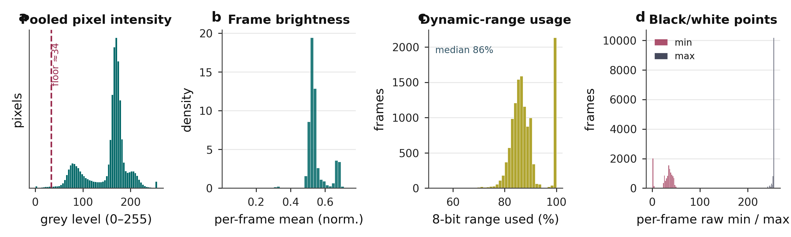
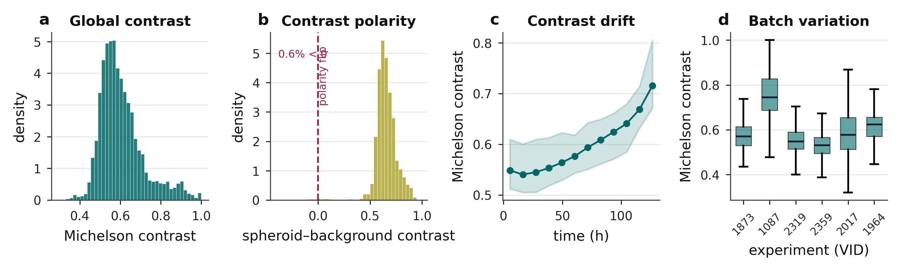
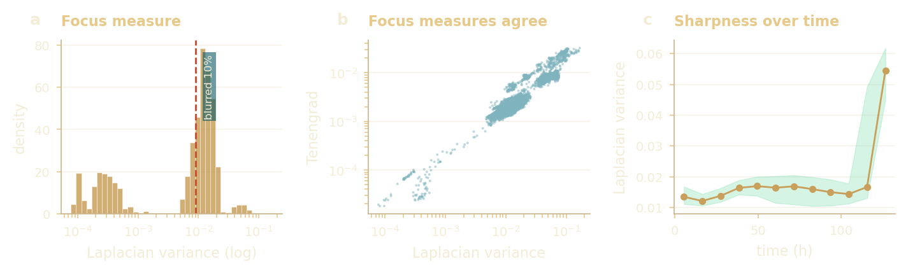
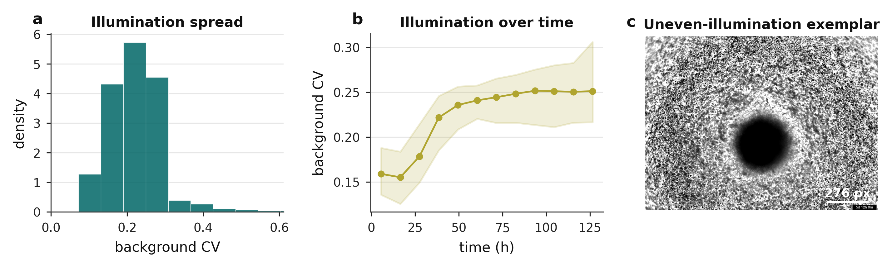
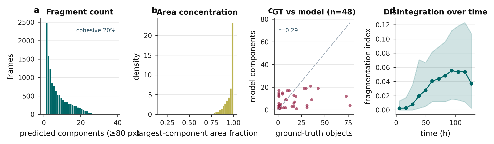
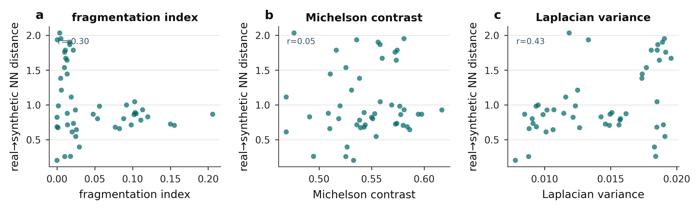

# What the data demands.

**Thesis target:** Theme 01 / Data exploratory analysis / Appendix A.1.

> The imaging reads size and gross shape robustly, but contrast, focus and fragmentation limit the finer boundary features, the same loss that later caps CPM-parameter identifiability.

Brightfield microscopy of patient-derived CLL spheroids is low-contrast, unevenly lit, and frequently fragmented under drug treatment. This analysis characterises what the images **are** (intensity, contrast, focus, illumination and fragmentation), then traces each property to the segmentation, metric and feature choice it drove downstream. The dataset inventory itself, who and how much, now lives in Theme 00.

| Metric | Value | Note |
|---|---|---|
| Hand-annotated | 51 | About 0.05% of the corpus, the defining constraint. |
| Contrast covered by aug. | ~100% | Offline augmented set (shared by all models). |
| Focus covered by aug. | ~91% | Laplacian-variance range spanned by augmentation. |
| Real wells out-of-library | ~90% | Why the thesis reports relative shifts, not absolutes. |

## A. What does the raw signal look like?  (why a learned segmenter, not thresholding)

### Contrast vs fragment count - 51 annotated frames

*(interactive chart in the HTML version)*

**What it shows.** Contrast spans roughly 0.46 to 1.0 across the annotated set, and higher contrast couples to more fragments, because separating fragments exposes bright background between dark material.

**What it motivated (Decision: learned segmenter + contrast-conditional preprocessing).** The wide, regime-dependent contrast (and the fragment-debris intensity overlap it creates) is why a single global threshold cannot work and a learned segmenter is needed, with contrast-conditional preprocessing in the classical baseline.

### Focus spread across frames - Laplacian variance, log scale

*(interactive chart in the HTML version)*

**What it shows.** Brightfield focus spans about 0.9 orders of magnitude, and background illumination is uneven.

**What it motivated (Decision: restrict inversion features).** Both inject noise into boundary-derived shape features, the exact perimeter and circularity features the CPM inference relies on, so inversion is restricted to features that survive segmentation noise.

### Intensity and dynamic range - pooled pixels &middot; frame brightness &middot; 8-bit usage

**What it shows.** Pooled pixel intensity is bimodal (a dark spheroid on a bright field); per-frame brightness clusters near mid-range, and frames use a median of 86% of the available 8-bit range.

**What it motivated (Decision: learned segmenter).** The two intensity modes overlap once debris is present, so a single global threshold cannot separate object from background, so a learned segmenter is needed.

### Contrast: level, polarity, drift, batch - Michelson contrast across the corpus

**What it shows.** Michelson contrast centres near 0.55 with only 0.6% of frames inverted (dark-on-light dominates), climbs over the time course (about 0.55 to 0.71), and varies between experiment batches.

**What it motivated (Decision: contrast-conditional preprocessing).** Contrast is wide, regime-dependent and drifting, which is why the classical baseline needs contrast-conditional preprocessing and the production segmenter is learned.

### Focus is bimodal and metric-agnostic - Laplacian variance, log scale

**What it shows.** Focus splits into a sharp main cluster and a blurred tail on a log scale, and two independent focus measures (Laplacian variance and Tenengrad) agree, so the spread is real, not an artefact of one metric.

**What it motivated (Decision: restrict inversion features).** Out-of-focus frames blur the boundary-derived perimeter and circularity features, reinforcing the restriction of inversion to features that survive segmentation noise.

### Illumination is uneven and worsens over time - background coefficient of variation

**What it shows.** Background illumination is uneven (CV about 0.2 to 0.25) and grows worse over the time course; the exemplar shows the shading and debris across the field (the dark disc at the centre is the spheroid itself).

**What it motivated (Decision: restrict inversion features).** Uneven background biases any intensity-based boundary, another reason the inversion leans on shape features that tolerate illumination drift.

## B. What is the object structure?  (the segmentation criterion: feature preservation)

### Components per annotated image - how multi-object the masks are

*(interactive chart in the HTML version)*

**What it shows.** Most frames are not a single object (median 8 components; about 70% have more than one), and fragment sizes span four orders of magnitude, from the main body down to specks below 100 px.

**What it motivated (Decision: CC-Dice + largest component).** Standard Dice is dominated by the largest component and is blind to small fragments, so CC-Dice (equal weight per component) is the right metric, and post-processing keeps the largest connected component.

### Fragment structure of the masks - counts &middot; area concentration &middot; over time

**What it shows.** Only about 20% of frames are a single cohesive object; most carry a long tail of fragments while the largest component still holds nearly all the area, and disintegration increases over the time course.

**What it motivated (Decision: CC-Dice + largest component).** Because masks are multi-object but area-dominated, ordinary Dice would ignore the small fragments, so CC-Dice scores every component, and post-processing keeps the largest one.

## C. A glimpse of the drug-response payoff  (preview only &middot; full analysis in Theme 05)

### Fragmentation by drug-mechanism class - median fragmentation index, classes with n>=30

*(interactive chart in the HTML version)*

**What it shows.** A single teaser: Syk-inhibitor and CXCR4-antagonist wells fragment most; BTK, NF-kB and MALT1 inhibitors sit lowest. Counts are large, unequal and plate-level, so this is read as an association only. The full drug-response analysis, auto-measured trajectories, per-drug inferred shifts and the BCR axis, lives in Theme 05.

**What it motivated (Preview only: full drug panel in Theme 05).** Previews the RQ3 drug-response story and shows the most drug-responsive classes are the hardest to segment, which is exactly why the segmenter is chosen on feature preservation rather than pixel overlap.

## D. From image quality to library coverage  (why the thesis reports relative shifts)

### Image quality predicts distance from the library - real to nearest-synthetic distance

**What it shows.** How far a real well sits from its nearest synthetic spheroid grows with fragmentation (r=0.30) and focus (r=0.43) but not with contrast (r=0.05): the qualities hardest to segment are also the least covered by the simulation library.

**What it motivated (Why relative shifts, not absolutes).** This is the mechanism behind the ~90% of real wells that fall outside the synthetic library, and the reason the inference is reported as relative shifts rather than absolute parameter values.

### Sources (canonical, executable)

This reader consolidates and re-orders the data EDA into the thesis's decision order. Interactive charts are computed from the same local CSVs the notebooks use (`imaging_eda/cache/labelled_qc.csv`, `frame_qc.csv`, `rq1_segmentation/results/feature_validation/timecourse_full_features.csv`); raster panels are the on-brand figures from the thesis figure set. Open the source notebooks for the full code and every panel:

**`thesis_submission/notebooks/RQ1_segmentation/01_data_eda.ipynb`** and **`imaging_eda/imaging_data_eda.ipynb`**.

An earlier broad notebook, `data/cll_spheroid_eda_complete.ipynb`, is catalogued as a referenced orphan in `_provenance_notes.md`.

## Set your own quality bar  (interactive, beyond the thesis)

## Complete analysis index  (every thesis analysis in this theme)

### Each analysis, what it shows, its thesis label, and the result

| Analysis | What it shows | Thesis label | Key result / status |
|---|---|---|---|
| Full data EDA | Intensity, contrast, focus, fragmentation over 51 annotated frames | appendix:data:eda | Shown interactively above |

**Sources / tools:** 01_data_eda.ipynb, imaging_data_eda.ipynb, labelled_qc.csv, frame_qc.csv, timecourse_full_features.csv, Chart.js + scikit-image
