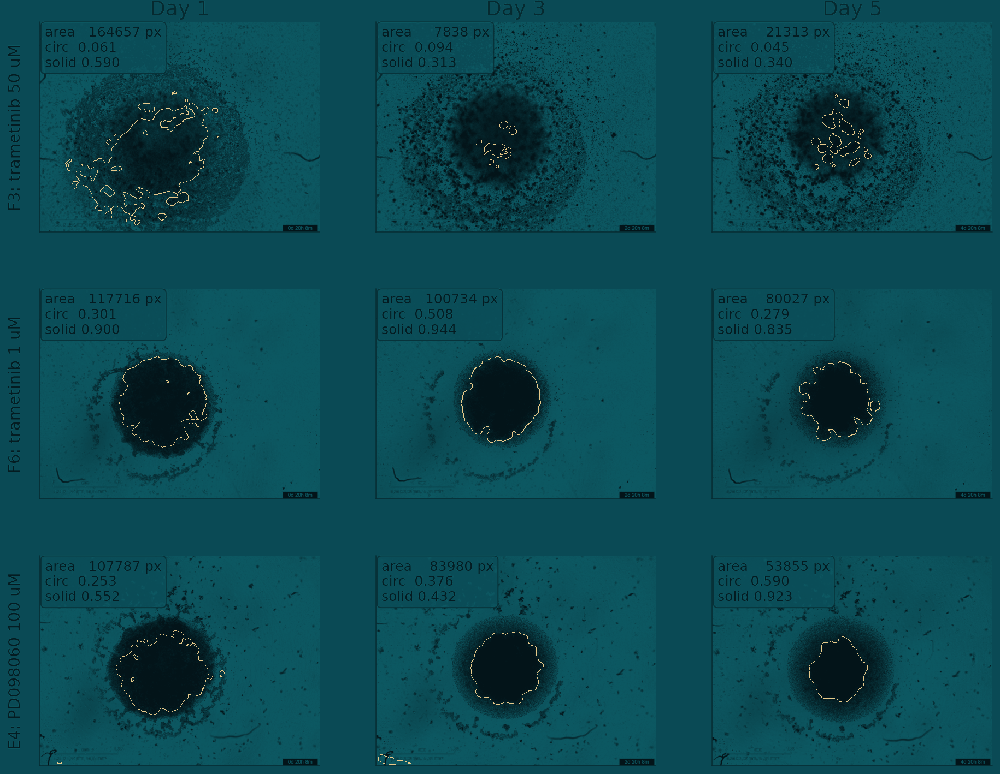
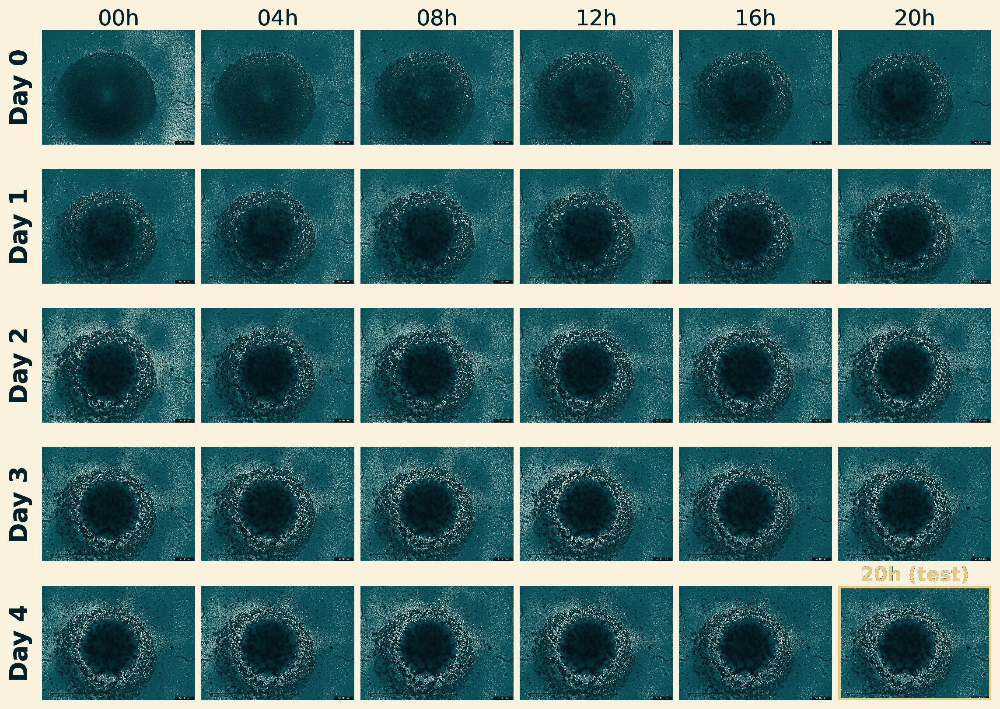

# Eight candidates, one winner.

**Thesis target:** Theme 02 / Segmentation & feature preservation / Appendix B.

> Pixel overlap cannot tell the candidates apart. The metric that matters for the downstream pipeline can, and it exposes a structural failure mode in three of them.

Eight segmenters were compared on the same 45-image test set: a rule-based baseline, three nnU-Net variants, two SAM2 variants, a heavy-augmentation U-Net, and a pseudo-label pretrain. The winner is chosen on the metric the next stage consumes: **do the AI-derived shape numbers agree with the human-annotated ones?** By that measure the heavy-augmentation U-Net wins by a wide margin, even though three models edge it on pixel overlap.

| Metric | Value | Note |
|---|---|---|
| Chosen model | U-Net | Heavy augmentation; only model crossing the reliability bar. |
| Models compared | 8 | All on the same 45-image test set. |
| Best pixel Dice | 0.829 | U-Net; nnU-Net essentially tied at 0.831. |
| Reliability bar | &ge; 0.85 | Concordance threshold from the radiomics standard (IBSI). |

### What the chosen segmenter produces - real frames, three drug conditions, three days

**What it shows.** The gold outline is the U-Net's call on frames it never saw in training; the boxes show the shape numbers (area, circularity, solidity) extracted from each.

**What it motivated (Why feature preservation, not pixels).** The unit of evaluation is these extracted numbers, not the pixel mask.

## Model leaderboard  (switch the metric)

### Ranking flips with the metric - click to switch

*(interactive chart in the HTML version)*

**What it shows.** Pixel overlap is nearly flat (0.755 to 0.829) and picks the U-Net by a hair. Shape-number agreement ranks the U-Net first by a wide margin and is the only metric that reflects what the next stage consumes.

**What it motivated (Decision: rank by feature preservation).** The segmenter is selected on shape-number agreement (Lin's CCC against the six CPM features), not pixel Dice. The heavy-aug U-Net is the only model above the 0.85 bar.

### Component-aware overlap (CC-Dice), measured models only

| Model | CC-Dice (mean, 45-image) | Note |
|---|---|---|
| nnU-Net (default) | 0.299 | Highest CC-Dice; still merges fragments (800 GT to 436 pred) |
| nnU-Net (multi-channel) | 0.295 | Multi-channel does not fix merging |
| SAM2 (multi-channel) | 0.100 | Over-fragments (800 GT to 1156 pred) |
| Classical (heuristic ROI) | 0.034 to 0.132 | Range across classical variants |
| U-Net (heavy aug.) | not computed | CC-Dice never scored for the U-Net; the old 0.18 was a ceiling claim, not a measurement |
| Pseudo-label + fine-tune | not computed | CC-Dice never scored for this model |

### Per-feature reliability scoreboard - 8 models x 6 shape numbers

**What it shows.** Each cell is the agreement between AI-derived and human-derived value of one shape number. Gold-outlined cells cross the 0.85 bar. Only the U-Net crosses, on area and diameter; roundness and elongation are unreliable for almost every model.

**What it motivated (Decision: operational feature set).** Sets the operational feature set for RQ3: area, diameter, solidity, perimeter, circularity; eccentricity is dropped, perimeter is U-Net-only.

## Cleanup impact  (overlap recovers, agreement does not)

### Pixel overlap with vs without cleanup - a small post-processing step

*(interactive chart in the HTML version)*

**What it shows.** The chosen U-Net (heavy aug.) is shown for reference: its masks need no cleanup, so the two bars are identical at 0.829. A morphological cleanup lifts nnU-Net pixel overlap by up to +0.044; the rule-based baseline barely benefits because its masks are already sparse.

**What it motivated (Negative result: cleanup is cosmetic for feature preservation).** On the metric that matters for the next stage this cleanup does not move the needle: it rescues pixel overlap, not shape-number reliability.

## Hardest case  (a fully fragmented spheroid)

### When the spheroid disintegrates - VID3201 F3, trametinib 50 uM, full time-lapse

**What it shows.** Under high-dose drug the spheroid breaks into many pieces. Pixel overlap drops for every model; area and diameter stay reliable while roundness and elongation collapse.

**What it motivated (Validates the feature-preservation audit).** This split is the entire reason the audit was needed, and why F3 is reported separately rather than excluded.

### Classical pipeline on the hardest frame - top 10 of the classical preproc / segmenter sweep

*(interactive chart in the HTML version)*

**What it shows.** This is the classical-pipeline sweep (the deep models, including the heavy-aug U-Net, are in the showcase above). Even the best classical combination reaches only about 0.45 Dice on this frame; no configuration rescues it.

**What it motivated (Bounds the hardest case).** Confirms F3 is a genuine ceiling, not a tuning artefact.

## Explore the leaderboard  (pixel overlap vs feature preservation)

## Complete analysis index  (every thesis analysis in this theme)

### Each analysis, what it shows, its thesis label, and the result

| Analysis | What it shows | Thesis label | Key result / status |
|---|---|---|---|
| Classical baseline | ROI extraction + multi-Otsu vs simpler alternatives, per-stage justification | app:classical_justification | Justifies ROI + 3-class Otsu |
| Segmentation candidates | 8 models on the fixed 216/45/45 split | app:baselines_table / tab:baselines | Classical, U-Net x2, nnU-Net x3, SAM2 x2 |
| Training configuration | Encoder, loss, augmentation, schedule, plate-level CV per model | app:experimental_setup / tab:hyperparams | ResNet34, BCE+Dice |
| U-Net feature CCC | Per-feature CCC and ICC(3,1) of U-Net vs manual masks (45-image test) | sec:res_rq1_1 / tab:rq1_1_features | Diameter 0.95, area 0.94, eccentricity 0.10 lost |
| Dice vs CCC ranking | All 8 models ranked by pixel Dice vs mean feature CCC | sec:res_rq1_2 / tab:rq1_2_fidelity | U-Net ties Dice 0.83, wins CCC 0.68 vs 0.31 (shown above) |
| U-Net config ablation | Test Dice across 13 U-Net variants during selection | app:aug_ablation / fig:aug_ablation | Heavy-aug config selected |
| ICC / CCC heatmaps | Full ICC and CCC matrices, 8 models x 6 features | app:segmentation_heatmaps | Shown above (heatmap) |
| Post-processing sweep | Change in mean feature CCC under 11 strategies, all 8 segmenters | app:ccc_postproc / fig:ccc_postproc_sweep | Cleanup is cosmetic for preservation (shown above) |
| Residual-refiner | Two-stage classical + learned correction | app:refiner_failure / tab:refiner | Negative result: collapses to identity |
| F3 time series | Most fragmented test frame across 4 days at 4 h cadence | app:f3_timeseries / fig:f3_timeseries | Shown above (hardest case) |
| Metric formulas | CCC, ICC(3,1), nRMSE, Dice, CC-Dice, component-count error | app:metric_formulas | Definitions |

**Sources / tools:** 05_feature_validation.ipynb, ICC(3,1) + Lin's CCC, per_feature_error.csv, seg_postproc.json, seg_f3.json, U-Net / SAM2 / nnU-Net
