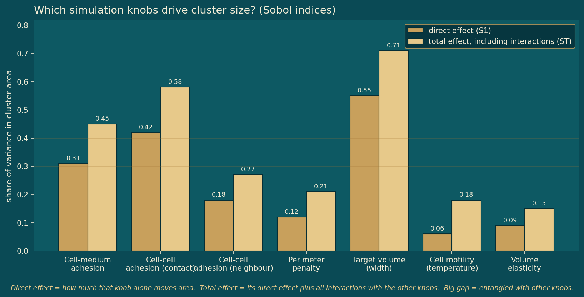

# The simulator, characterised.

**Thesis target:** Theme 03 / Synthetic CPM library / Appendix C & F.

> Seven mechanistic knobs, swept one at a time and jointly, build the synthetic library the real spheroids are matched against.

A Cellular Potts Model with seven parameters (cell-cell and cell-medium adhesion, contact range, neighbour order, volume elasticity, target volume, and motility) is sampled to build a reference library of morphology trajectories. This theme shows how each knob changes the simulated cluster, and accounts for which runs were usable.

| Metric | Value | Note |
|---|---|---|
| CPM parameters | 7 | Swept one-at-a-time and jointly (Saltelli). |
| Sampled vectors | 1,152 | Saltelli design over the 7 parameters. |
| Usable runs | 1,105 | After dropping degenerate masks. |
| Dropped | 47 | Empty or single-pixel masks, removed. |

## How each knob changes morphology  (one-at-a-time sweeps)

### Cluster area vs parameter level - switch the parameter

*(interactive chart in the HTML version)*

**What it shows.** Target volume (width) and cell-cell adhesion move cluster area the most; neighbour order and motility barely move it on their own.

**What it motivated (Sets up the identifiability question).** Identifies which knobs leave a size signature in morphology, the precondition for being recoverable later.

## Which knobs drive cluster size?  (Sobol indices, direct vs total effect)

### Sobol first-order vs total effect - share of variance in cluster area

**What it shows.** Direct effect (S1) is how much a knob alone moves area; total effect (ST) adds its interactions with the other knobs. A large gap means the knob is entangled.

**What it motivated (Entanglement bounds identifiability).** Target volume dominates; cell-cell and cell-medium adhesion carry sizeable interaction effects. Entanglement is what limits how cleanly a single knob can be read back from morphology.

### Library yield - sampled to usable

*(interactive chart in the HTML version)*

**What it shows.** Of 1,152 sampled parameter vectors, 1,105 produced usable masks; 47 were dropped as empty or single-pixel (degenerate) spheroids.

**What it motivated (Defines the reference library).** The usable 1,105-run library is the single reference set for all matching and identifiability analysis.

## Complete analysis index  (every thesis analysis in this theme)

### Each analysis, what it shows, its thesis label, and the result

| Analysis | What it shows | Thesis label | Key result / status |
|---|---|---|---|
| CPM configuration | 1536x1152 lattice, blob r=250 px, 1000 MCS, 100 frames, 9 (OAT) / 3 (Saltelli) seeds | app:cpm_sim_settings / tab:sim_settings | CompuCell3D 4.5.0 |
| OAT sweep grid | Per-parameter levels for the one-at-a-time sweep | app:oat_sweep_grid / tab:sweeps | 76,500 snapshots, shown above |
| Saltelli design & yield | Saltelli N=128, d=7, 1152 runs; degenerate dropped | sec:setup_sim_data | 1,105 viable, 47 dropped (shown above) |
| VTK feature extraction | CC3D lattice to binary mask to 6 features via skimage.regionprops | app:cpm:vtk | Reproducibility note (Appendix C) |
| Sobol estimators | Jansen first- and total-order estimators, paired sampling design | app:sobol_estimators | Schematic + equations |
| Reproducibility | GPU A100, Python 3.10, PyTorch 2.3.1, CC3D 4.5.0, seed 42, AI-tool disclosure | app:reproducibility / tab:reproducibility | Fixed seeds, full environment |

**Sources / tools:** cpm_sweeps.json, CompuCell3D, Saltelli design, VTK feature extraction, 1,105-run library
