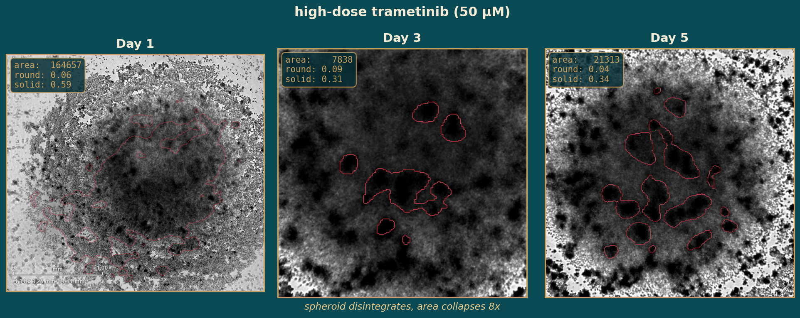
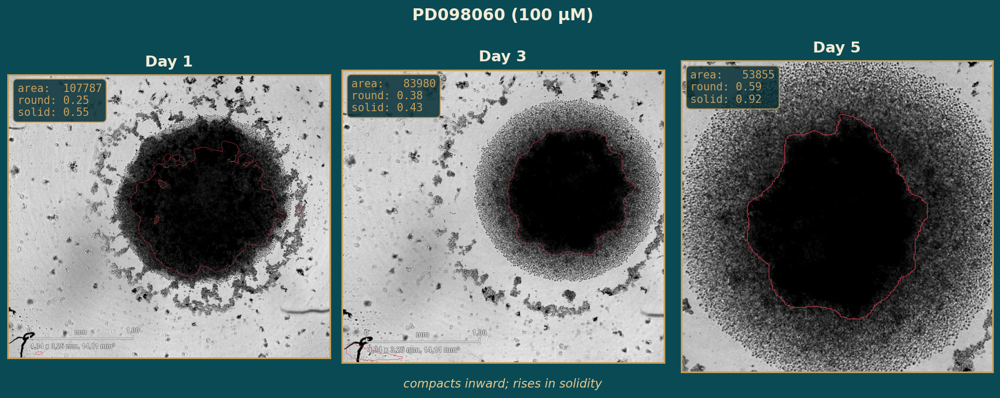
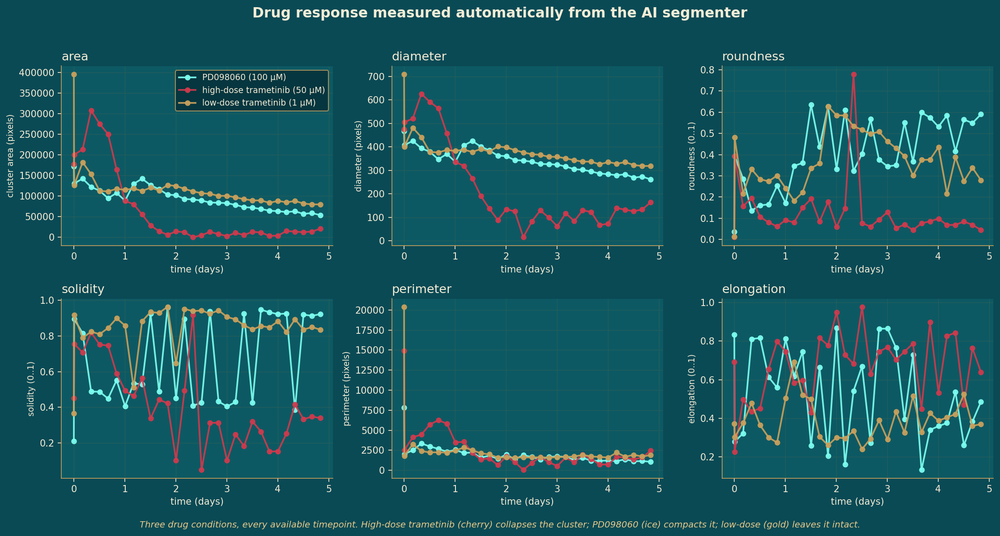
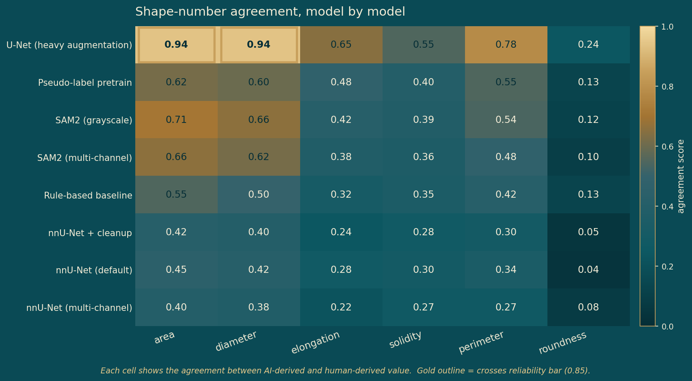

# Real spheroids, relative shifts.

**Thesis target:** Theme 05 / Drug panel & real-data inference / Appendix I & J.

> The pipeline inverts real morphology to CPM parameters; the inferred shifts on the weakly identifiable axes are read as relative changes, not biophysical effects.

Real spheroid trajectories from reference wells across seven patients and a panel of drug conditions are inverted to CPM parameters on the three weakly identifiable axes. The inferred shifts are read as relative, simulation-derived changes, not absolute or biophysical values.

| Metric | Value | Note |
|---|---|---|
| Patients | 7 | Reference wells inverted across 7 patients. |
| Read as | shifts | Relative change on the weakly identifiable axes, not absolutes. |
| Drug-panel shift | weak | Panel-wide BCR-axis J_cc shift is small with a bootstrap interval including zero; magnitude under revision. |
| Reported axes | 3 | the three weakly identifiable axes (width, J_cc, J_cm). |

## What the drugs do to morphology  (three dose conditions)

### High-dose trametinib collapses the cluster - MEK inhibitor, 50 uM

**What it shows.** The cluster loses cohesion and breaks apart over the time course.

**What it motivated (Relative shift on the contact axes).** An end-state shift in the inferred contact parameters; magnitude under revision.

### PD098060 compacts the cluster - MEK pathway, 100 uM

**What it shows.** The cluster stays cohesive but contracts, a different morphological signature from high-dose trametinib.

**What it motivated (Separable drug signatures).** Distinct drugs leave distinct, separable trajectories.

### Feature trajectories under treatment - extracted automatically per condition

**What it shows.** Per-condition shape trajectories, the observable the matcher compares against the synthetic library.

**What it motivated (Feeds the inversion).** These trajectories drive the inversion that produces the per-condition parameter shifts.

### Feature agreement on the real data - AI-derived vs reference

**What it shows.** Agreement between AI-derived and reference shape numbers on the real spheroids, the same reliability check applied in Theme 02.

**What it motivated (Closes the loop with RQ1).** Confirms the real-data features used for inversion are the reliable ones.

## Complete analysis index  (every thesis analysis in this theme)

### Each analysis, what it shows, its thesis label, and the result

| Analysis | What it shows | Thesis label | Key result / status |
|---|---|---|---|
| Tau-registered matcher | Phase-axis tau, z-scored features, Sobol-weighted MAD, k=20, empirical posterior | sec:setup_matching | Primary matcher |
| Worked example (VID1797 F1) | One well: observed trajectory to empirical posterior intervals | app:worked_real_inference / fig:example_inversion_appendix | Shows how data narrows each parameter |
| Boundary & coverage | Neighbours at sweep endpoints; real-to-library NN distance | app:boundary_coverage / fig:boundary_saturation_appendix | ~90% of real spheroids extrapolated |
| Stimulation reproducibility | Per-parameter, how many of 7 patients shift the same way under stimulation | sec:res_rq3_1 / fig:rq3_1_stability | J_cm & J_cc 7/7 agree, width 3/7 |
| Expected vs observed shift | Baseline vs stimulated medians vs a priori biological prediction | sec:res_rq3_2 / tab:rq3_2_expected | J_cm -30% (7/7), J_cc -7% (7/7) match |
| Drug-class lookup | 23 drugs by mechanism class with targets and expected effects | app:drug_classes / tab:drug_lookup | BTKi, Syk, PI3K, JAK, CXCR4, MEK, NF-kB, ... |
| Drug-panel delta J_cc | Per-drug J_cc shift, by class, bootstrap CI; tau vs end-state matcher | app:drug_panel_jcc / fig:h33_drug_panel_appendix | Value under revision |

**Sources / tools:** real_data_inference_report.ipynb, drug panel, tau-registration matcher, bootstrap CIs, 7 patients
